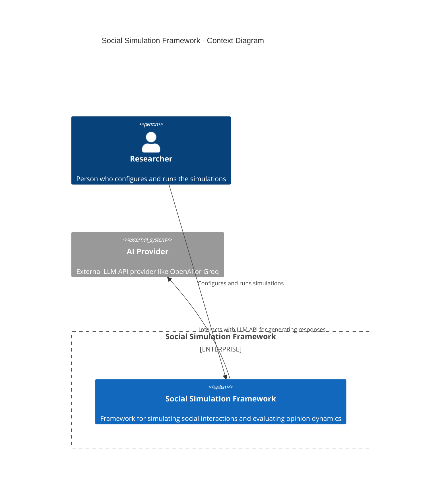
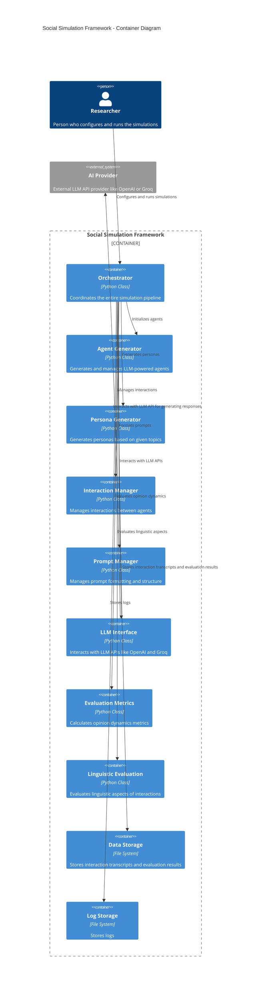
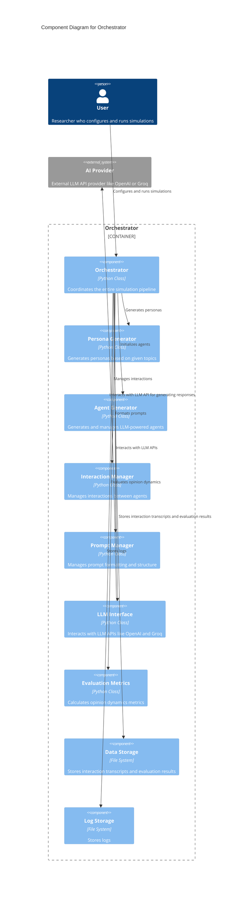
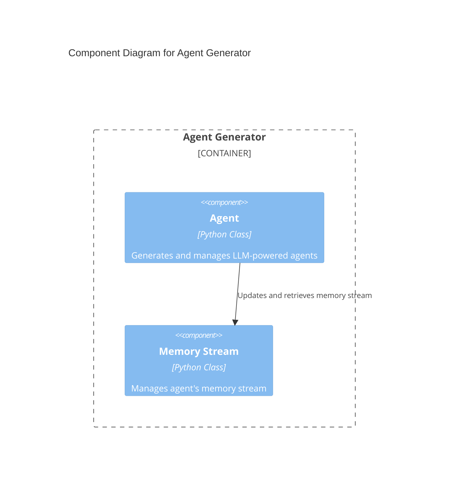
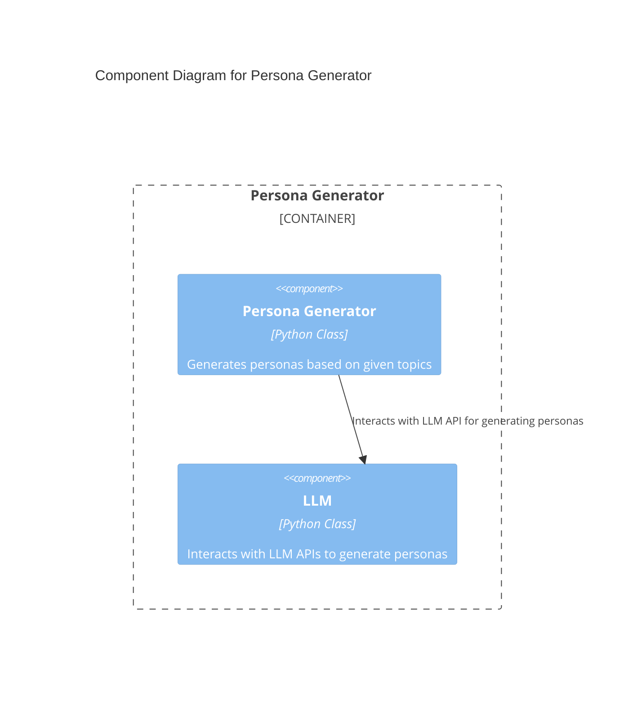
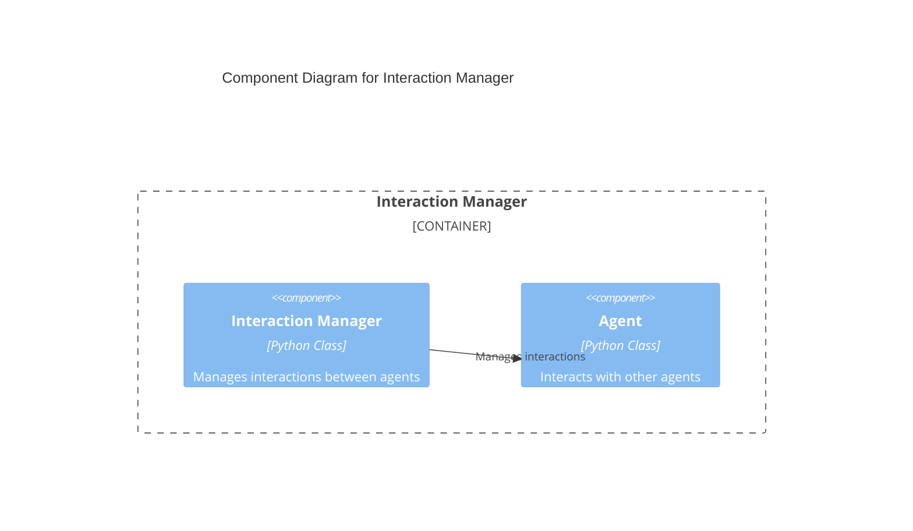
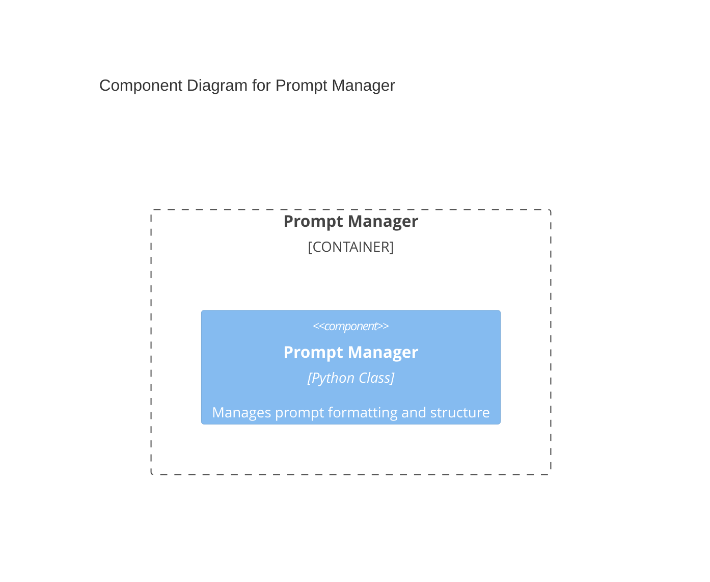
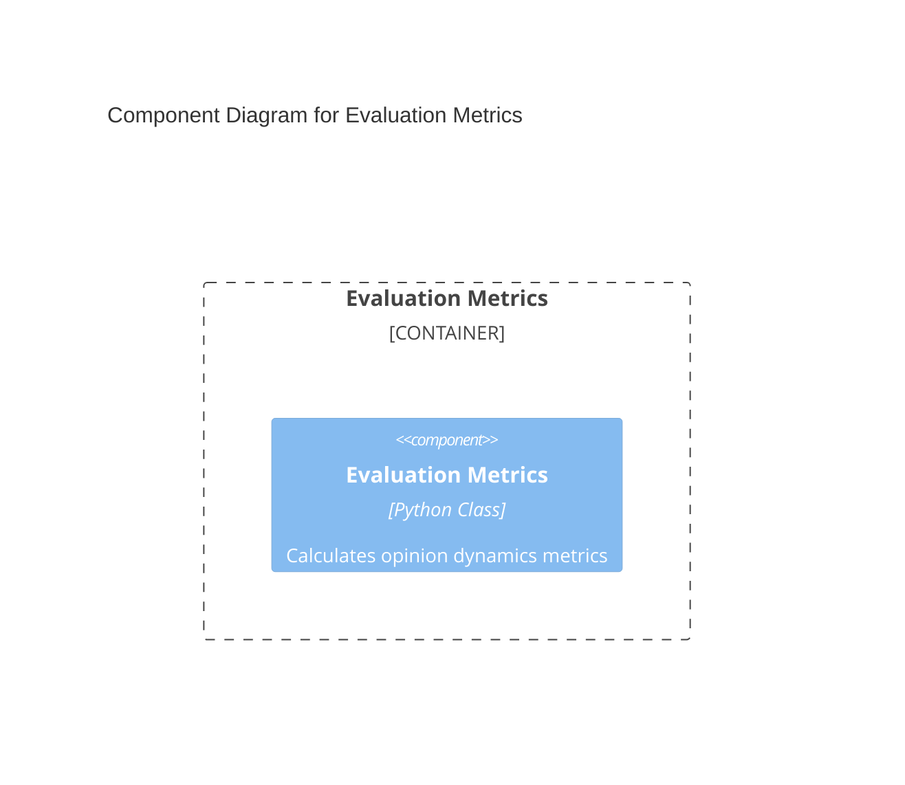
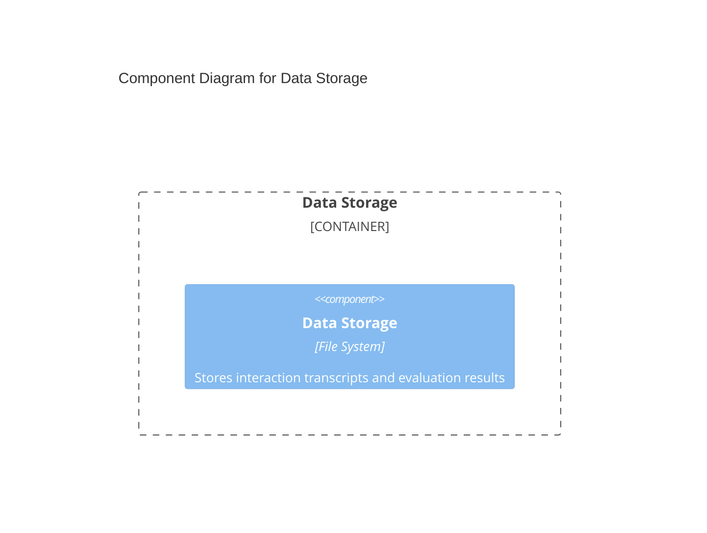
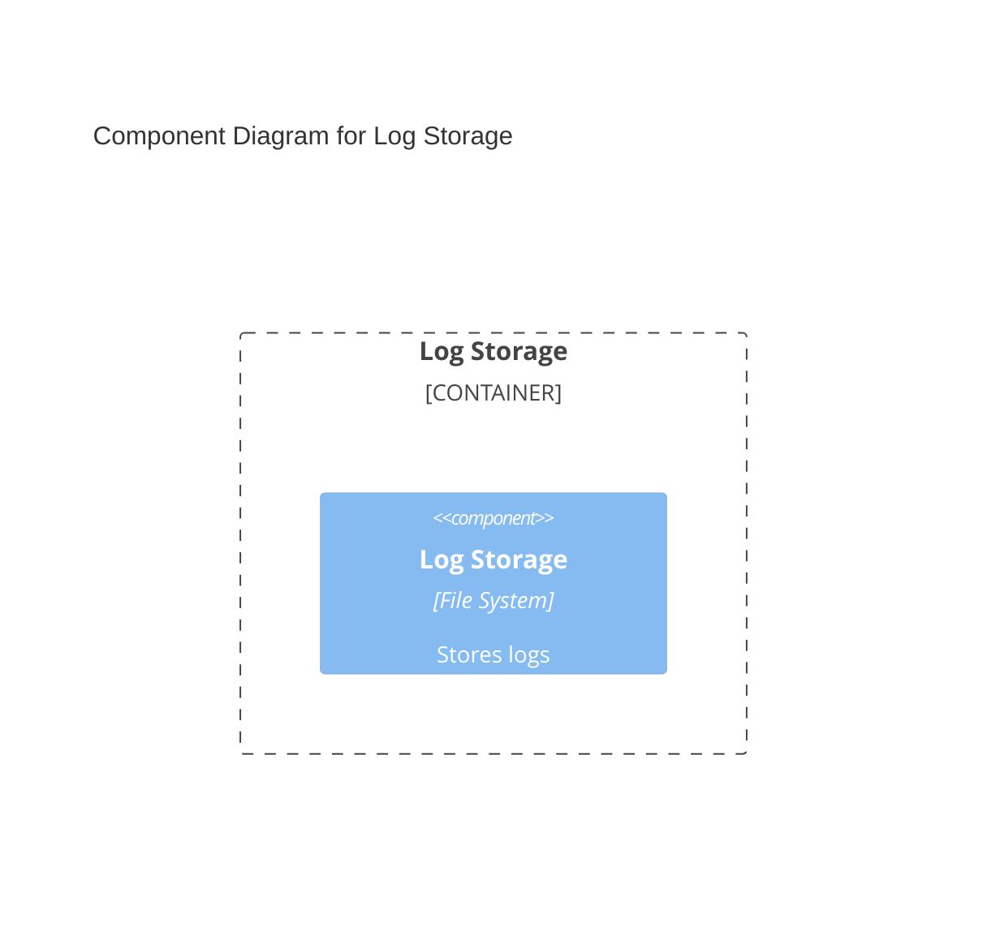

## Context Diagram



## Container Diagram



### Explanation of the Container Diagram

- External Entities
  - User (Researcher):

    - Role: Configures and runs the simulations.
    - Interaction: Interacts with the Orchestrator to set up and execute simulations.
  - AI Provider:

    - Role: Provides external LLM API services (e.g., OpenAI, Groq).
    - Interaction: The LLM Interface interacts with the AI Provider to generate responses and personas.

#### Containers within the Social Simulation Framework

**Orchestrator:**

    Description: Coordinates the entire simulation pipeline.

    Responsibilities:
		- Configures and runs simulations.
		- Manages the flow of data between other containers.
		- Initiates the generation of personas and agents.
		- Manages interactions and evaluations.

    Interactions:
		- Receives configuration and execution commands from the User.
		- Interacts with other containers to perform its tasks.

**Agent Generator:**

    Description: Generates and manages LLM-powered agents.
	Responsibilities:
		Creates agents based on personas.
		Manages agent interactions and memory updates.
	Interactions:
		Receives persona data from the Orchestrator.
		Interacts with the LLM Interface to generate agent responses.

**Persona Generator:**

    Description: Generates personas based on given topics.
	Responsibilities:
		Creates detailed personas with identity, demographics, and initial beliefs.
	Interactions:
		Receives topic data from the Orchestrator.
		Provides generated personas to the Orchestrator.

**Interaction Manager:**

    Description: Manages interactions between agents.
	Responsibilities:
		Facilitates the exchange of messages between agents.
		Ensures interactions follow the defined protocols.
	Interactions:
		Receives interaction commands from the Orchestrator.
		Manages the flow of messages between agents.

**Prompt Manager:**

    Description: Manages prompt formatting and structure.
	Responsibilities:
		Formats prompts for interactions.
		Ensures prompts are structured correctly for LLM processing.
	Interactions:
		Receives prompt formatting requests from the Orchestrator.
		Provides formatted prompts to the Orchestrator and LLM Interface.

**LLM Interface:**

    Description: Interacts with LLM APIs like OpenAI and Groq.
	Responsibilities:
		Sends requests to external LLM APIs.
		Receives and processes responses from LLM APIs.
	Interactions:
		Receives interaction requests from the Orchestrator and Agent Generator.
		Sends requests to and receives responses from the AI Provider.

**Evaluation Metrics:**

    Description: Calculates opinion dynamics metrics.
	Responsibilities:
		Evaluates interaction transcripts.
		Calculates metrics such as bias and diversity.
	Interactions:
		Receives transcripts from the Orchestrator.
		Provides evaluation results to the Orchestrator.

**Data Storage:**

    Description: Stores interaction transcripts and evaluation results.
	Responsibilities:
		Saves transcripts of interactions.
		Stores evaluation results for further analysis.
	Interactions:
		Receives data from the Orchestrator.
		Provides stored data when requested.

**Log Storage:**

    Description: Stores logs.
	Responsibilities:
		Saves logs generated during the simulation process.
	Interactions:
		Receives log data from the Orchestrator and other containers.
	Provides stored logs for debugging and analysis.

## Component Diagrams
### Component Diagram for Orchestrator

### Component Diagram for Agent Generator


### Component Diagram for Persona Generator


### Component Diagram for Interaction Manager


### Component Diagram for Prompt Manager


### Component Diagram for LLM Interface
```mermaid
C4Component
    title Component Diagram for LLM Interface

    Container_Boundary(c4, "LLM Interface") {
        Component(llmInterface, "LLM Interface", "Python Class", "Interacts with LLM APIs like OpenAI and Groq")
        Component(promptManager, "Prompt Manager", "Python Class", "Formats prompts for LLM APIs")
    }

    Rel(llmInterface, promptManager, "Formats prompts")
    Rel(llmInterface, aiProvider, "Interacts with LLM API for generating responses")

    UpdateLayoutConfig($c4ShapeInRow="2",$c4BoundaryInRow="1")
```

### Component Diagram for Evaluation Metrics



### Component Diagram for Data Storage



### Component Diagram for Log Storage

