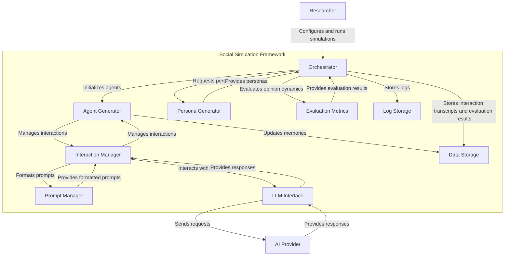

# Data Flow and Dependencies

* User to Orchestrator: The user configures and runs simulations through the Orchestrator.
* Orchestrator to Persona Generator: The Orchestrator requests the generation of personas based on the given topics.
* Orchestrator to Agent Generator: The Orchestrator initializes agents using the generated personas.
* Orchestrator to Interaction Manager: The Orchestrator manages interactions between agents.
* Orchestrator to Prompt Manager: The Orchestrator formats prompts for interactions.
* Orchestrator to LLM Interface: The Orchestrator interacts with LLM APIs to generate responses.
* Orchestrator to Evaluation Metrics: The Orchestrator evaluates opinion dynamics using the Evaluation Metrics container.
* Orchestrator to Data Storage: The Orchestrator stores interaction transcripts and evaluation results.
* Orchestrator to Log Storage: The Orchestrator stores logs generated during the simulation process.
* LLM Interface to AI Provider: The LLM Interface sends requests to and receives responses from the AI Provider.
