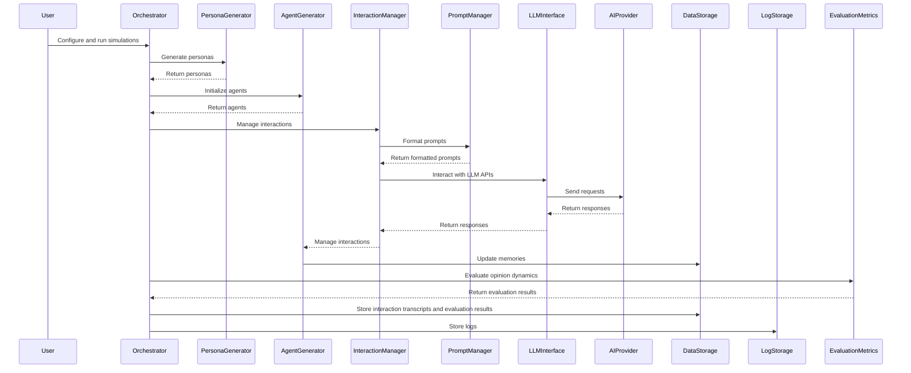

# Sequence Diagram

## Explanation

1. User:
   1. Configures and runs simulations through the Orchestrator.
2. Orchestrator:
   1. Coordinates the entire simulation pipeline.
   2. Requests personas from the Persona Generator.
   3. Initializes agents using the Agent Generator.
   4. Manages interactions through the Interaction Manager.
   5. Formats prompts using the Prompt Manager.
   6. Interacts with LLM APIs via the LLM Interface.
   7. Evaluates opinion dynamics using the Evaluation Metrics container.
   8. Stores interaction transcripts and evaluation results in Data Storage.
   9. Stores logs in Log Storage.
3. Persona Generator:
   1. Generates personas based on given topics.
4. Agent Generator:
   1. Generates and manages LLM-powered agents.
   2. Manages interactions and updates memories.
5. Interaction Manager:
   1. Manages interactions between agents.
      Formats prompts and interacts with LLM APIs.
6. Prompt Manager:
   1. Manages prompt formatting and structure.
7. LLM Interface:
   1. Interacts with LLM APIs like OpenAI and Groq.
      Sends requests to and receives responses from the AI Provider.
8. AI Provider:
   1. Provides external LLM API services.
9. Evaluation Metrics:
   1. Calculates opinion dynamics metrics.
10. Data Storage:
    1. Stores interaction transcripts and evaluation results.
11. Log Storage:
    1. Stores logs generated during the simulation process.
